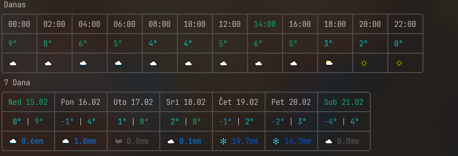
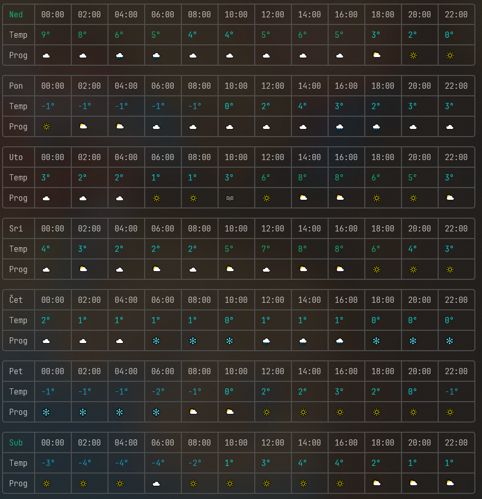

# Vrijeme

CLI weather tools for Zagreb using [Open-Meteo API](https://open-meteo.com/).

## Commands

`vri` — today's hourly forecast + 7-day summary in a single view



`vri 7f` — full hourly breakdown for each of the next 7 days



`temp` — current conditions: temperature, humidity, wind


## Setup

Requires [uv](https://docs.astral.sh/uv/).

```
uv run vrijeme.py
uv run vrijeme.py 7f
uv run temperatura.py
```

Shell aliases (optional):
```sh
alias vri='uv run ~/path/to/vrijeme.py'
alias temp='uv run ~/path/to/temperatura.py'
```

## Planned

- [ ] Combine API calls into a single request to reduce latency
- [ ] Sunrise/sunset display between today and 7-day tables
